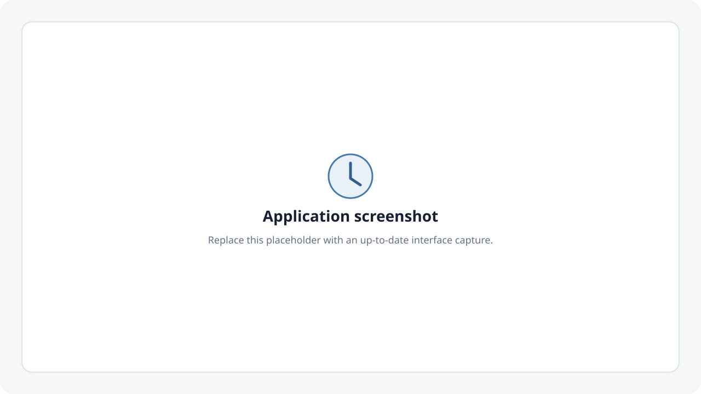

# Death Clock

A local life-in-months grid that projects when each of your projects becomes financially feasible.



## Requirements

- Python 3.11 or newer

## Install and run

```bash
git clone https://github.com/qaabdulaziz/death-clock.git
cd death-clock
python3 -m venv .venv
source .venv/bin/activate        # Windows: .venv\Scripts\activate
pip install -r requirements.txt
uvicorn app.main:app --reload
```

Open [http://localhost:8000](http://localhost:8000).

On first run, the app creates `deathclock.db` automatically and walks you through a short setup. The database is ignored by Git and stays on your machine. Every assumption can be changed later.

## What the projection means

For each future month, the backend applies monthly compounding and then adds the configured contribution:

```text
monthly_rate = (annual_return_rate / 100) / 12
balance = balance × (1 + monthly_rate) + monthly_contribution
```

Projects use a **soonest affordable first** rule. After each month's growth and contribution, the engine checks the cheapest project that has not started. If the full cost is available, it records that month as the project's start, deducts the full cost, and checks the next-cheapest project. Multiple projects can start in one month. Because every cost is deducted sequentially, funding one project can delay all later projects.

A project that cannot be fully funded before the configured life-expectancy horizon is shown as not reachable within the projected lifetime.

## Data, backup, and reset

All persistent state—settings and projects—lives in the local `deathclock.db` SQLite file. The browser does not store application data in `localStorage`.

- **Back up:** stop the server and copy `deathclock.db` to a safe location.
- **Restore:** stop the server and replace `deathclock.db` with the backup copy.
- **Reset:** use **Reset all data** in the settings panel. This removes every project and restores neutral defaults.

Never commit `deathclock.db`; it can contain private financial and personal information.

## Development

Install the test dependencies and run the suite:

```bash
pip install -r requirements-dev.txt
python -m pytest -q
```

The application uses FastAPI, SQLite, and plain HTML/CSS/JavaScript. There is no frontend build step or package manager.

## Disclaimer

Death Clock is a planning and visualisation tool based on simplified assumptions. It is not financial advice. Actual investment returns, costs, timing, inflation, taxes, and personal circumstances vary and may differ substantially from the projection.

## License

MIT
